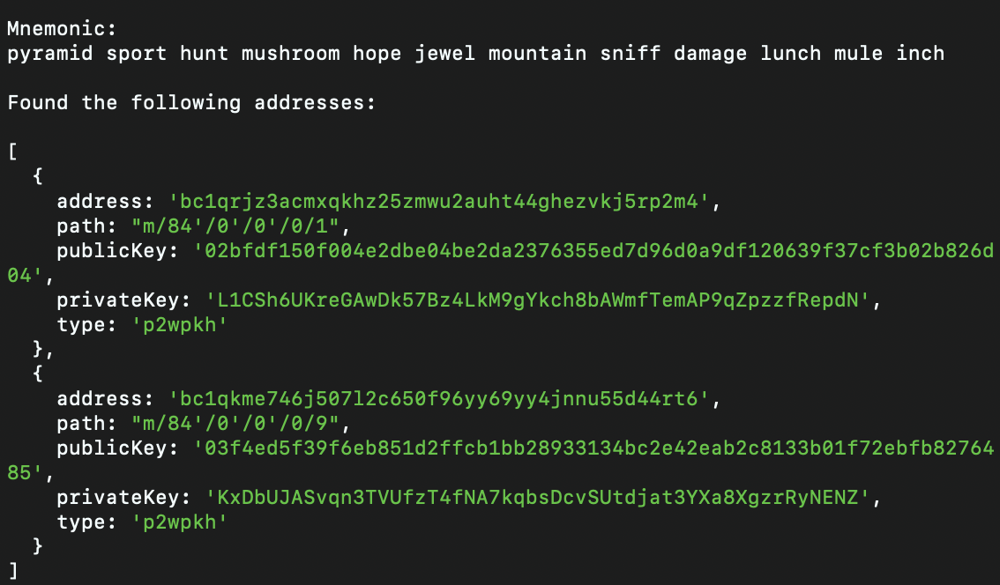

# address-finder

### Description
Used to search for a set of provided addresses by iterating over many possible standard and non-standard address derivation paths.

## Getting started

```bash
git clone https://github.com/coreyphillips/address-finder
cd address-finder
yarn install
````
Once installed, open `index.js` and:
 - Replace the `MNEMONIC` variable with the mnemonic you would like to test.
 - Replace the addresses in the `ADDRESSES_TO_SEARCH_FOR` variable with the addresses you would like the program to search for.
 - `50` addresses per path are generated by default, but can be adjusted by changing the `MAX_INDEX_COUNT` variable.

Then run:
```bash
node .
````

If matches are found you will be greeted with something resembling the following response:
```
Mnemonic:
pyramid sport hunt mushroom hope jewel mountain sniff damage lunch mule inch

Found the following addresses:

[
  {
    address: 'bc1qrjz3acmxqkhz25zmwu2auht44ghezvkj5rp2m4',
    path: "m/84'/0'/0'/0/1",
    publicKey: '02bfdf150f004e2dbe04be2da2376355ed7d96d0a9df120639f37cf3b02b826d04',
    privateKey: 'L1CSh6UKreGAwDk57Bz4LkM9gYkch8bAWmfTemAP9qZpzzfRepdN',
    type: 'p2wpkh'
  },
  {
    address: 'bc1qkme746j507l2c650f96yy69yy4jnnu55d44rt6',
    path: "m/84'/0'/0'/0/9",
    publicKey: '03f4ed5f39f6eb851d2ffcb1bb28933134bc2e42eab2c8133b01f72ebfb8276485',
    privateKey: 'KxDbUJASvqn3TVUfzT4fNA7kqbsDcvSUtdjat3YXa8XgzrRyNENZ',
    type: 'p2wpkh'
  }
]
```


